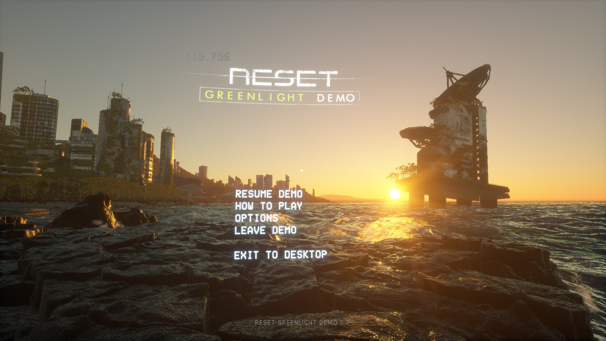

# RESET Dat Extractor
This is a command line application for extracting/repacking files from .dat archives for the unreleased indie game [RESET](https://web.archive.org/web/20220319222636/http://reset-game.net/). This application is designed for the greenlight demo that was released in September 22 2015, although since the build was taken down *(there is still a [download link](http://www.mediafire.com/file/ebx4y2ixaeopnxp/Reset_Greenlight_Demo_0.4.exe/file) for the demo. If it's down let me know and I can put up a new one.)*

### Usage

`app.exe extract [inputDirectory]`
`app.exe repack [inputDirectory]`

Searches the directory for .dat files and automatically extracts all of them. Creating a folder matching the name of the extracted dat file and extracting the files in the data archive in that folder on the disk.

For repacking, it searches the directory for folders. All of the files in the folders are recursively gathered and then compiled into a .dat archive for each folder.

### Screenshots

*(Screenshot of in-game main menu, modded here thanks to the unpack/repacker allowing me to be able to alter some of the precomputed cloud textures)*

*Steam Greenlight Demo of the unreleased indie game [RESET](https://web.archive.org/web/20220319222636/http://reset-game.net/), [get it here](http://www.mediafire.com/file/ebx4y2ixaeopnxp/Reset_Greenlight_Demo_0.4.exe/file).*

